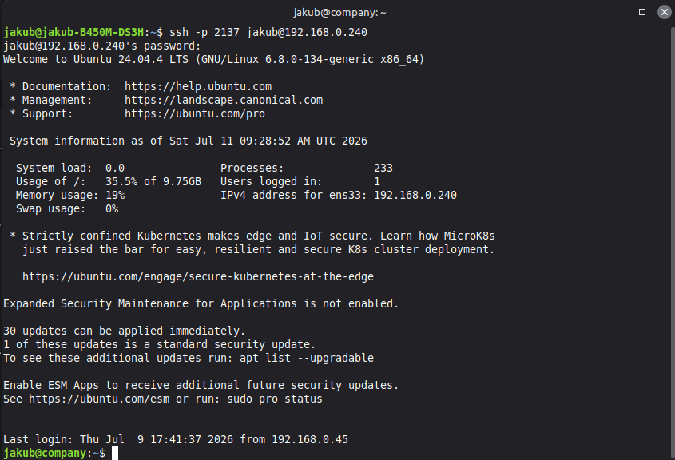
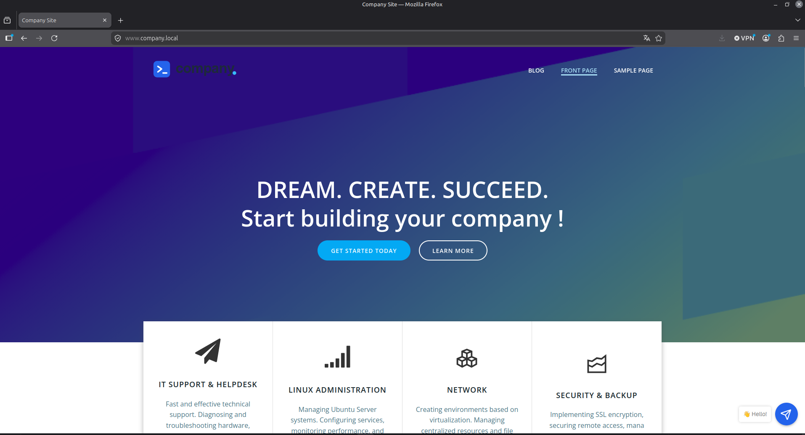
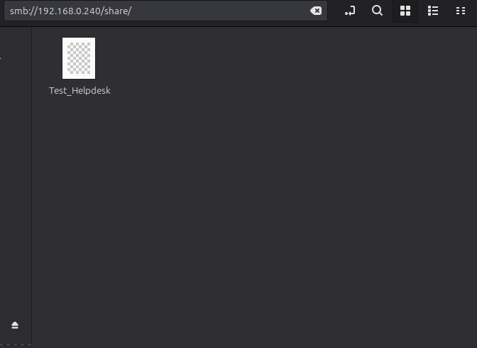
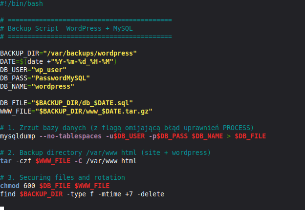
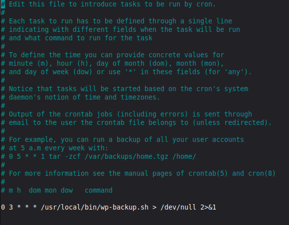
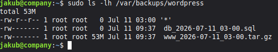

# Ubuntu Server Infrastructure 🐧

**Educational infrastructure deployment for centralized network management**
This project involves the comprehensive setup and configuration of an Ubuntu Server environment. It solves the problem of decentralized data storage and web service hosting by implementing an automated, secure local server architecture.

## 🛠️ Technologies
* Ubuntu Server (LTS)
* OpenSSH (Custom socket activation)
* Samba (SMB/CIFS)
* LAMP Stack (Apache2, MySQL, PHP)
* WordPress CMS
* Bash Scripting & Cron

## ✨ Features
* Secured remote access using a non-standard SSH port.
* Centralized file sharing configured for local network users via Samba.
* Internal web application hosting utilizing Apache and WordPress.
* Fully automated Disaster Recovery system executed via Bash.
* Automated retention policy for old backup files (7-day rotation).

## ⚙️ The Process
The deployment followed a structured approach:
1. **System Initialization:** OS installation and basic networking setup.
2. **Remote Access:** Hardening OpenSSH daemon and configuring firewall (UFW) rules.
3. **Storage Services:** Deploying Samba for local cross-platform file sharing.
4. **Web Hosting:** Installing LAMP stack, configuring VirtualHosts, and deploying WordPress.
5. **Automation:** Writing a custom Bash script for database dumps and web directory archiving, scheduled via Crontab.

## 📊 Proof of Concept / Testing

### 1. Secure Remote Access (SSH)

**Action:** Connecting to the server remotely using a non-standard port (`2137`). The terminal displays successful authentication and the Ubuntu Server welcome message, confirming the customized SSH daemon configuration is operational.

### 2. Web Hosting & SSL Verification (WordPress)

**Action:** Accessing the fully deployed WordPress CMS via a secure HTTPS connection (`https://www.company.local`). The presence of the padlock icon confirms successful SSL certificate implementation, while the customized front page serves as a technical portfolio for IT services.

### 3. Network File Sharing (Samba)

**Action:** Accessing the shared network directory via a client machine file manager using the SMB protocol (`smb://192.168.0.240/share/`). The presence of the `Test_Helpdesk` file confirms read/write permissions are correctly assigned.

### 4. Disaster Recovery Script (Bash)

**Action:** Creating a custom Bash script (`wp-backup.sh`) that automates `mysqldump` for the database and `tar` for the web directory. The script includes a dedicated function to find and delete files older than 7 days to manage disk space autonomously.

### 5. Task Scheduling (Crontab)

**Action:** Editing the root user's crontab to execute the backup script automatically every day at 3:00 AM (`0 3 * * *`), effectively implementing an unattended maintenance window.

### 6. Automated Backup Verification

**Action:** Listing the contents of the `/var/backups/wordpress` directory. The output verifies that the script successfully generated both the SQL database dump (`.sql`) and the compressed web directory archive (`.tar.gz`) exactly at 03:00.

## 💡 What I Learned
* Hardening Linux server security and managing background services.
* Resolving permissions and file ownership issues in a Linux environment.
* Writing practical Bash scripts for automated system administration.
* Managing Apache VirtualHosts and CMS directory structures.

## 🚀 What can be improved
* Implementation of Docker containers for better service isolation.
* Adding an automated off-site backup sync (e.g., using `rsync` or cloud storage).
* Deploying a monitoring stack (Prometheus & Grafana) for real-time system metrics.

## How to run the Project
1. Set up an Ubuntu Server VM on your local hypervisor.
2. Install required packages: `apache2`, `mysql-server`, `php`, `samba`.
3. Change the default SSH port and reload the `ssh.socket` daemon.
4. Configure the Samba share in `/etc/samba/smb.conf`.
5. Deploy the backup script to `/usr/local/bin/`, make it executable (`chmod +x`), and add it to the root crontab.
